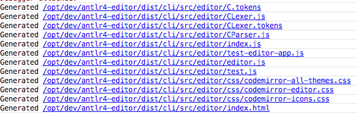

# Antlr4 Editor

## Overview
The goal of this project/library is to provide developers with a simple to use API to develop
web compatible code editors, using only Antlr4 Grammars. Allowing for the creation of the editor and language
to be more unified during the development process. 

**(Currently the only fully supported editor platform is codemirror at the moment)**

## Getting Started
```bash
npm install -S antlr4-editor
```

### Example Generating An Editor

Generate the source files for creating a C Editor.
```javascript
antlr4-editor -o src/editor -r compilationUnit samples/c/C.g4
```
Example Output



Run the Test Editor Application
```javascript
node ./src/editor/test-editor-app.js
```


### Javascript Code of a Simple C Editor

Given that you've generated editor source code, the following code creates
a simple C language code editor.

```javascript
const createEditor = require('./editor').createEditor;

const editor = createEditor();
editor.setEditorPlaceholderText('Enter your code here...');

editor.setShowLineNumbers(true);
editor.setDisplayEditorErrors(true);
editor.focus();

const el = editor.getDomElement();

// Render the editor
document.body.appendChild(el);

```

### TODOS

- [ ] Improve API Documentation
- [ ] Add Ace Editor Support
- [ ] Add Monaco Editor Support
- [ ] Create Sample Editors
- [ ] Publish Sample Editors
- [ ] Create Tutorials
- [X] Add CodeMirror Support
- [ ] Provide CLI Support
